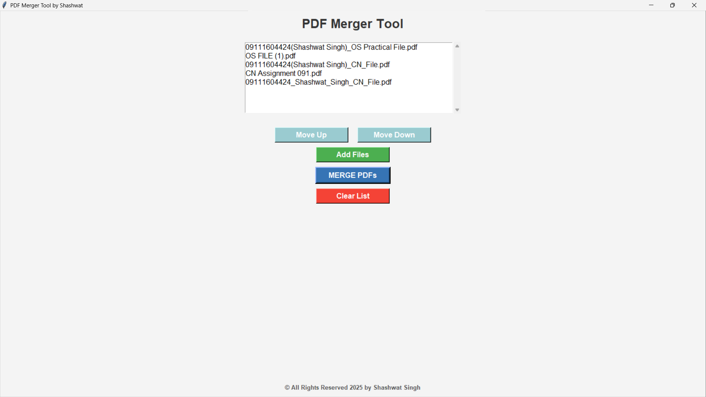

# PDF Merger Tool in Python

Welcome to the **PDF Merger Tool**! This easy-to-use tool allows you to merge multiple PDF files into a single PDF with just a few clicks. With a simple interface, you can quickly select, reorder, and combine your PDFs without any hassle.

## Features

- **File Selection**: Add multiple PDFs via the file dialog.
- **Reorder Files**: Move files up or down in the list to set the merging order.
- **Merge PDFs**: Combine your selected PDFs into a single output file.
- **Clear List**: Remove all files from the current list at any time.
- **User-Friendly Interface**: Built with Tkinter for a clean, simple, and intuitive UI.

## Screenshots

  
*Screenshot of the PDF Merger Tool UI.*

## Requirements

- **Python 3.x**
- **Tkinter** (Standard library, comes pre-installed with Python)
- **PyPDF2** (To handle PDF merging)

### Install the required libraries:
```bash
pip install PyPDF2
```

## How to Run

1. Clone this repository:
   ```bash
   git clone https://github.com/imshashwatsingh/pdf-merger-tool.git
   ```
2. Navigate to the project directory:
   ```bash
   cd pdf-merger-tool
   ```
3. Run the script:
   ```bash
   python pdfMerger.py
   ```
4. Use the "Add Files" button to select PDFs.
5. Use "Move Up" or "Move Down" buttons to change the order of merging.
6. Click on "Merge PDFs" to combine the files into a single PDF.
7. Click on "Clear List" to remove all selected files.

## Running the .exe Version

If you prefer to run the application without installing Python, you can use the pre-built executable:

1. Download the `.exe` file from the **Releases** section.
2. Double-click the `.exe` file to open the PDF Merger Tool.
3. Follow the steps mentioned above to merge your PDFs.

## Usage

- **Add Files**: Use the file dialog to select PDF files from your file system.
- **Reorder Files**: Move PDFs up or down using the buttons.
- **Merge PDFs**: Click the "Merge PDFs" button to combine the selected PDFs into a new file.
- **Clear List**: If you want to remove all files from the list, click "Clear List".

## License

This project is licensed under the MIT License - see the [LICENSE](LICENSE) file for details.

## Contact

If you have any questions or feedback, feel free to open an issue or contact me on [GitHub](https://github.com/imshashwatsingh).

Happy Merging! 🎉

