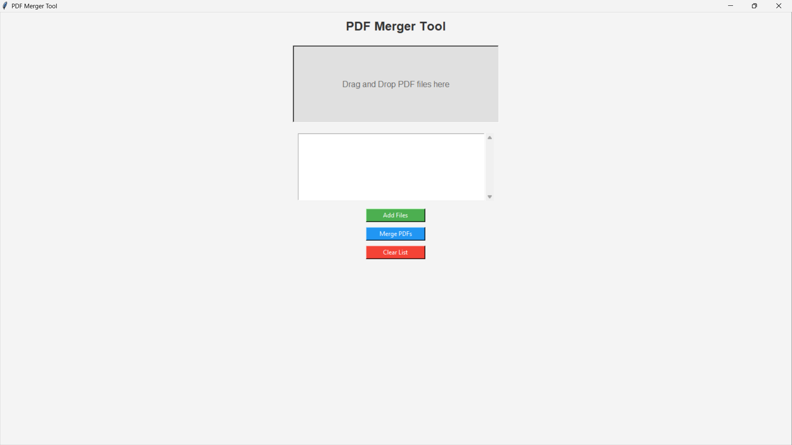

# PDF Merger Tool in Python

Welcome to the **PDF Merger Tool**! This easy-to-use tool allows you to merge multiple PDF files into a single PDF with just a few clicks. You can quickly select and combine your PDFs without any hassle.

## Features

- **Drag and Drop**: Easily add PDFs by dragging and dropping them into the application window.
- **File Selection**: Add multiple PDFs via the file dialog.
- **Merge PDFs**: Combine your selected PDFs into a single output file.
- **Clear List**: Remove all files from the current list at any time.
- **User-Friendly Interface**: Built with Tkinter for a clean, simple, and intuitive UI.


## Screenshots

  
*Screenshot of the PDF Merger Tool UI.*

## Requirements

- **Python 3.x**
- **Tkinter** (Standard library, comes pre-installed with Python)
- **tkinterdnd2** (For drag-and-drop support)
- **PyPDF2** (To handle PDF merging)

### Install the required libraries:
```bash
pip install tkinterdnd2 PyPDF2
```

## How to Run

1. Clone this repository:
   ```bash
   git clone https://github.com/imshashwatsingh/pdf-merger-in-python.git
   ```
2. Navigate to the project directory:
   ```bash
   cd pdf-merger-in-python
   ```
3. Run the script:
   ```bash
   python pdfMerger.py
   ```
4. Drag and drop your PDF files into the window or use the "Add Files" button to select them.
5. Click on "Merge PDFs" to combine the files into a single PDF.

## Usage

- **Drag and Drop**: Drag PDF files directly into the window.
- **Add Files**: Use the file dialog to select PDF files from your file system.
- **Merge PDFs**: Click the "Merge PDFs" button to combine the selected PDFs into a new file.
- **Clear List**: If you want to remove all files from the list, click "Clear List".

## License

This project is licensed under the MIT License - see the [LICENSE](LICENSE) file for details.

## Contact

If you have any questions or feedback, feel free to open an issue or contact me on [GitHub](https://github.com/imshashwatsingh).

Happy Merging! 🎉
